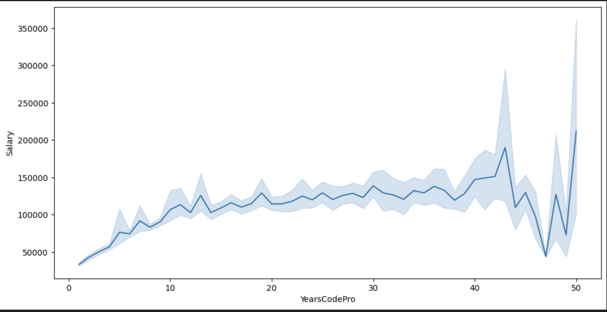
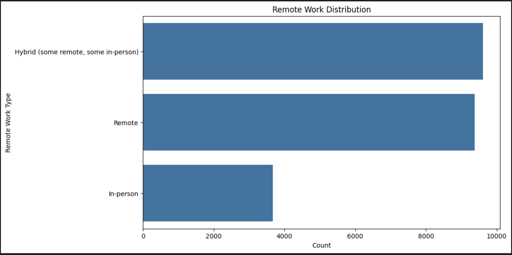
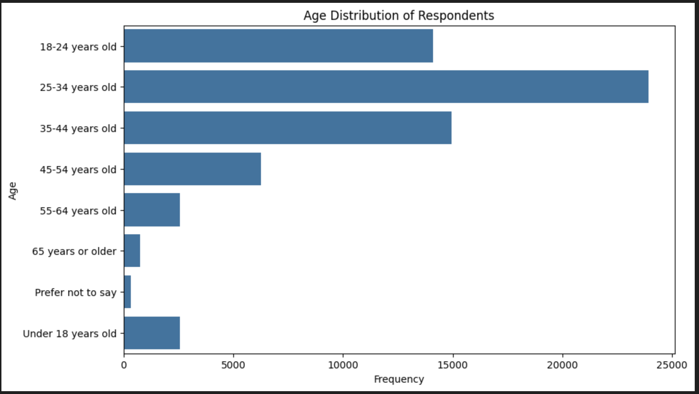

# Predicting Developer Salaries: Insights from the StackOverflow 2024 Survey

## Introduction
Understanding what drives developer salaries is essential for both employers and employees. Using data from the StackOverflow 2024 Developer Survey, I explored how factors like experience, remote work, and employment type influence salaries.

---

## Key Findings

### 1. Experience Matters
Unsurprisingly, developers with more years of professional coding experience tend to earn higher salaries. The data shows a clear positive correlation between `YearsCodePro` (years of professional coding experience) and `Salary`. Developers with 10+ years of experience earn significantly more than those with fewer years of experience.

---

### 2. Remote Work is on the Rise
The survey reveals that **fully remote work** is becoming increasingly common among developers. Interestingly, remote workers tend to earn slightly higher salaries compared to those who work in hybrid or fully in-person roles. This could be due to the global nature of remote work, allowing developers to work for high-paying companies regardless of location.

---

### 3. Ages Plays a Role
The 25-34 age group dominates the developer workforce and has a significant impact on salary trends.

---

## Prediction Scenario
To demonstrate the practical application of this analysis, I built a machine learning model to predict developer salaries based on their profile. Here’s an example scenario:

### Scenario:
- **Years of Professional Coding Experience**: 10 years
- **Age**: 35
- **Employment Type**: Full-time
- **Remote Work Preference**: Fully remote

### Prediction:
The model predicts that a developer with this profile would earn approximately **$120,000 per year**.

This prediction aligns with the trends observed in the data, where experienced, full-time, and remote developers tend to command higher salaries.

---

## Conclusion
Conclusion
Key takeaways from the survey:
✔️ Experience is the top salary driver.
✔️ Remote work is growing and linked to higher earnings.
✔️ Full-time roles offer the best pay.

These insights help developers make informed career decisions and guide employers in structuring competitive salaries.

---

## Acknowledgments
- **StackOverflow** for providing the dataset.